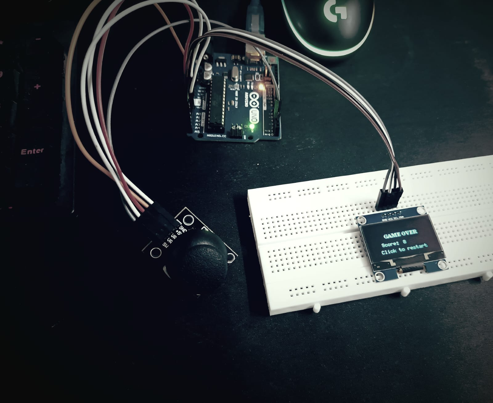
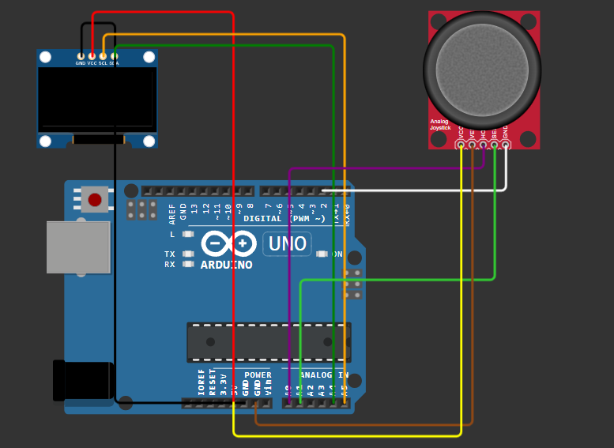

# 🐍 Snake Game on Arduino UNO

This project implements the classic **Snake Game** using an **Arduino UNO**, **1.3" SSD1306 OLED Display**, and a **joystick module**. Designed for simplicity and fun, it runs entirely on embedded hardware—no PC required!

## 🎮 Features

- Classic snake game mechanics (eat food, grow longer, avoid walls)
- Joystick control (up/down/left/right)
- Game-over animation and restart via joystick button
- Lightweight code using `U8g2lib` for fast OLED rendering

---

## 🛠 Hardware Requirements

| Component             | Quantity |
|-----------------------|----------|
| Arduino UNO           | 1        |
| SH1106 1.3" OLED (I2C)| 1        |
| Joystick Module       | 1        |
| Breadboard & Jumper Wires | As needed |

---

## 🔌 Wiring

### OLED Display (I2C)

| OLED Pin | Arduino UNO Pin |
|----------|------------------|
| VCC      | 3.3V/5V          |
| GND      | GND              |
| SDA      | A4               |
| SCL      | A5               |

### Joystick Module

| Joystick Pin | Arduino UNO Pin |
|--------------|------------------|
| GND          | GND              |
| VCC          | 5V               |
| VRx          | A0               |
| VRy          | A1               |
| SW (Button)  | D2               |

---

## 💾 Software Requirements

- Arduino IDE
- Install the following libraries via Library Manager:
  - **U8g2** by olikraus (`U8g2lib`)
  - (No need for Adafruit libraries)

---

## 🖼️ Project Setup
<ul>
  <li>

  <h4>Real-Life Image</h4>
  
  
</li>
  <li>

  <h4>Diagram</h4>
  
  
</li>
</ul>

---
## 🧪 How to Play

1. Connect your hardware as per the wiring table.
2. Upload the `snake_game.ino` to your Arduino UNO using the Arduino IDE.
3. Use the joystick to control the snake.
4. Eat food to grow longer.
5. Game over if you hit the wall or yourself.
6. Press the joystick button to restart.

---

## 🔮 Future Enhancements

- Include sound effects using a buzzer
- Difficulty modes (speed increase over time)
- Save high score in EEPROM

